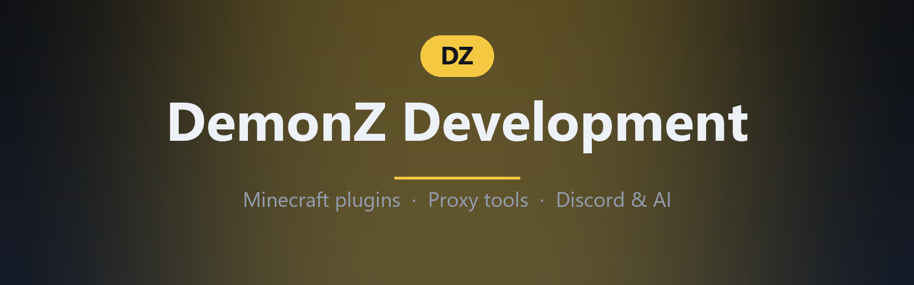

  

# DemonZ Development

We build Minecraft plugins and proxy tooling for **Paper, Spigot, Folia, Velocity, Fabric and Forge** — plus the Discord bots, websites and AI tooling that run alongside them.

[🌐 demonzdevelopment.online](https://demonzdevelopment.online) · [💬 Discord](https://discord.com/invite/GYsTt96ypf) · [📦 Modrinth](https://modrinth.com/user/demonzdevelopment) · [🤖 NexaraAI](https://github.com/NexaraAI) · [✉️ Email](mailto:demonzdevelopment@gmail.com)

---

## Plugins & Tools

| Project | What it does |
|---|---|
| **[DZEconomy](https://github.com/DemonZ-Development/DZEconomy)** · [Modrinth](https://modrinth.com/plugin/dzeconomy) | Three-currency economy engine — conversions, PvP loot drops, combat tagging, LuckPerms multipliers, full Developer API |
| **[VelocityNavigator](https://github.com/DemonZ-Development/VelocityNavigator)** · [Modrinth](https://modrinth.com/plugin/velocitynavigator) | Lobby navigation and intelligent load balancing for Velocity proxies |
| **[Geo-Restrict](https://github.com/DemonZ-Development/Geo-Restrict)** · [Modrinth](https://modrinth.com/plugin/georestrict) | Country, ASN, VPN and proxy access rules for servers and proxy networks |
| **[RedstoneReboot](https://github.com/DemonZ-Development/RedstoneReboot)** · [Modrinth](https://modrinth.com/plugin/redstonereboot) | Restart engine for Bukkit, Paper, Spigot, Folia, Fabric, Forge and NeoForge |
| **[ZDiscord](https://github.com/DemonZ-Development/ZDiscord)** · [Modrinth](https://modrinth.com/plugin/zdiscord) | Discord chat bridge, role sync and server info |
| **[Chaos-Chickens](https://github.com/DemonZ-Development/Chaos-Chickens)** · [Modrinth](https://modrinth.com/plugin/chaos-chickens) | Chickens with random chaos traits — explosive, speedy, golden, teleporting |
| **[OnlySleep](https://github.com/DemonZ-Development/Onlysleep)** · [Modrinth](https://modrinth.com/plugin/onlysleep) | One player sleeping skips the night — fully configurable |
| **[CraftyAI](https://github.com/DemonZ-Development/CraftyAI)** · [Modrinth](https://modrinth.com/plugin/craftyai) | An intelligent AI assistant for Minecraft |

## Infrastructure

| Project | What it does |
|---|---|
| **[CreeperCLI](https://github.com/DemonZ-Development/creepercli)** | Remote administration for Minecraft servers — Java plugin + Node.js CLI |
| **[demonzdevelopment.online](https://github.com/DemonZ-Development/DemonZDevelopment)** | Source for the org website (TypeScript) |

## AI & Agents

We're building the [NexaraAI](https://github.com/NexaraAI) platform — autonomous AI tooling for Minecraft and beyond:

| Project | What it does |
|---|---|
| **[Nexara Agent](https://github.com/NexaraAI/Nexara-agent)** | Cross-platform autonomous agent framework powered by Gemini, with a resilient 4-tier LLM fallback chain |
| **[Nexara Skills](https://github.com/NexaraAI/Nexara-skills)** | 80+ modular cross-platform skills with AST safety scanning and SHA256 integrity verification |
| **[CraftyAI-500M](https://github.com/NexaraAI/CraftyAI-500M)** | ~488M-parameter Minecraft companion LLM, trained from scratch with a custom NA-BPE tokenizer |

---

## Support

Found a bug or have a feature request? Open an issue on the project's repository — or drop into the [Discord](https://discord.com/invite/GYsTt96ypf) and we'll get back to you.

*Java-first, community-driven.*
